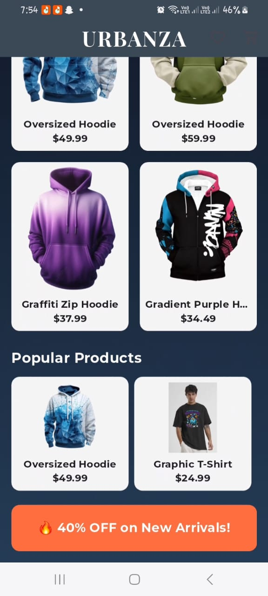
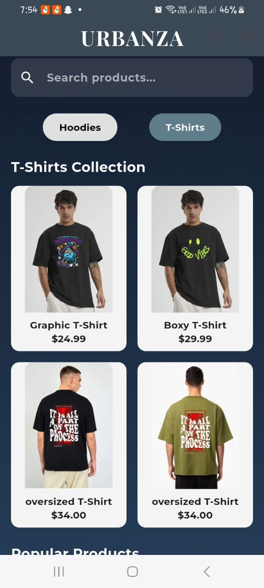
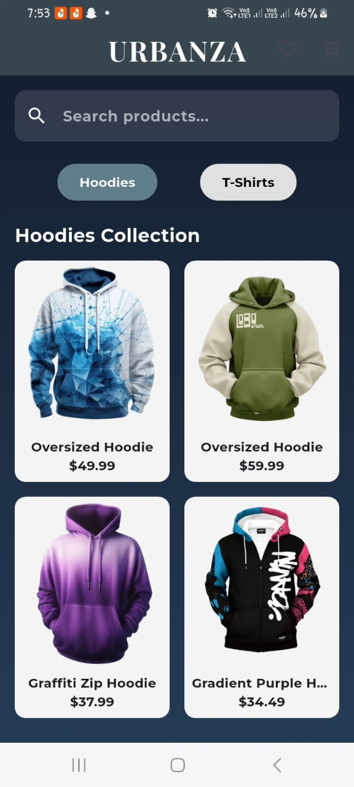
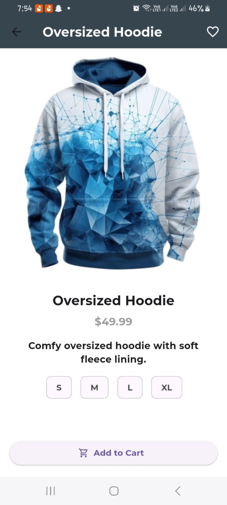
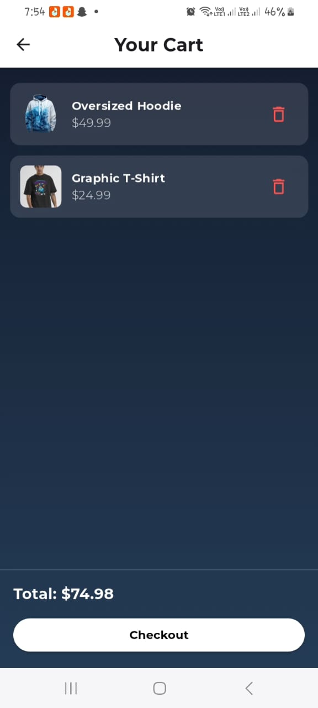
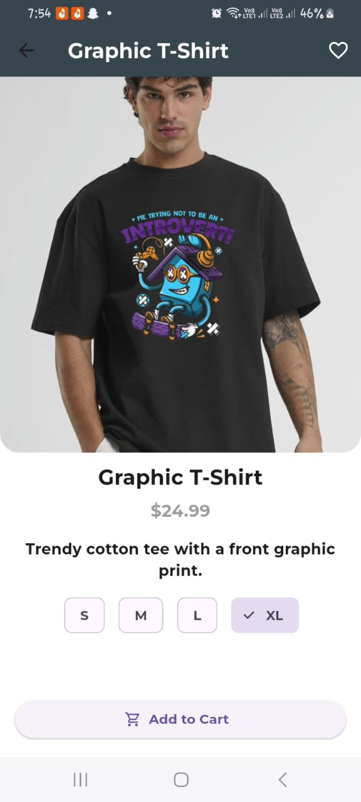
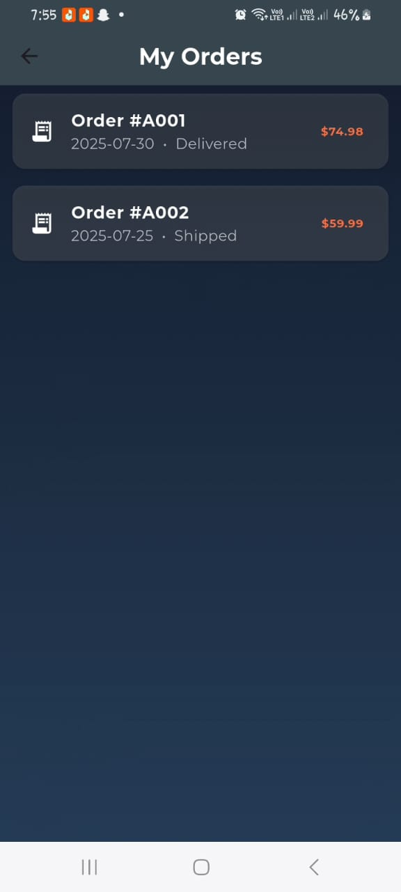

# E-Commerce UI – Fashion App

A beautifully designed **fashion e-commerce app UI** built with **Flutter**, showcasing modern animations, hero transitions, custom fonts, and clean category-based browsing.

This app is perfect for showcasing Gen-Z fashion like **hoodies** and **t-shirts** in a bold, luxurious UI.


## Screenshots

<div align="center">
  
  
  
  <br/><br/>
  
  
  
  <br/><br/>
  
  
</div>


## Features

-  Category-based product listing (T-Shirts, Hoodies)
-  Custom fonts using **Google Fonts**
-  Navigation using **Named Routes**
-  Wishlist & 🛒 Cart Screens
-  Hero animation & transitions
-  Shimmer loading effect on home screen
-  Checkout and Orders screen
-  Gradient splash screen


##  Getting Started

1. **Clone the repo**
   ```bash
   git clone https://github.com/Anniekarim29/clothing_ecommerce_ui
   cd e_commerce_app
