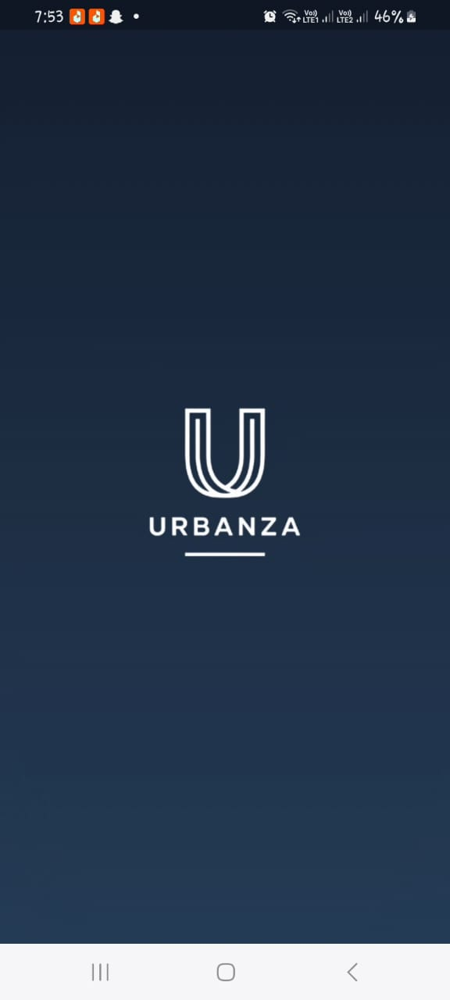

# E-Commerce UI – Fashion App

A beautifully crafted fashion e-commerce app UI built with Flutter, tailored for a bold and modern shopping experience.

Designed to resonate with Gen-Z aesthetics, this UI features smooth hero animations, elegant custom typography, and a clean, category-based layout that makes browsing hoodies and t-shirts feel luxurious and seamless.

Whether you're building your first e-commerce app or seeking design inspiration, this project brings together functionality and visual finesse wrapped in a sleek mobile interface.


## Screenshots

<div align="center">
  
  
  
  <br/><br/>
  
  
  
  <br/><br/>
  
  
</div>


## Features

-  Category-based product listing (T-Shirts, Hoodies)
-  Custom fonts using **Google Fonts**
-  Navigation using **Named Routes**
-  Wishlist & 🛒 Cart Screens
-  Hero animation & transitions
-  Shimmer loading effect on home screen
-  Checkout and Orders screen
-  Gradient splash screen


##  Getting Started

1. **Clone the repo**
   ```bash
   git clone https://github.com/Anniekarim29/clothing_ecommerce_ui
   cd e_commerce_app
